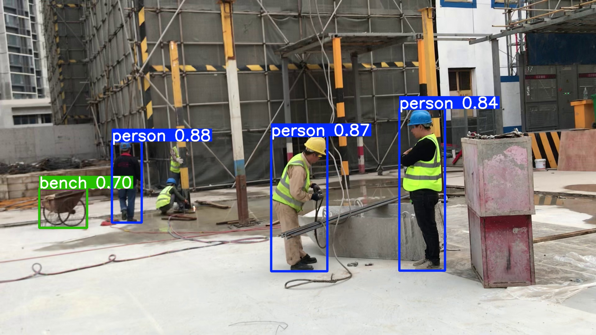
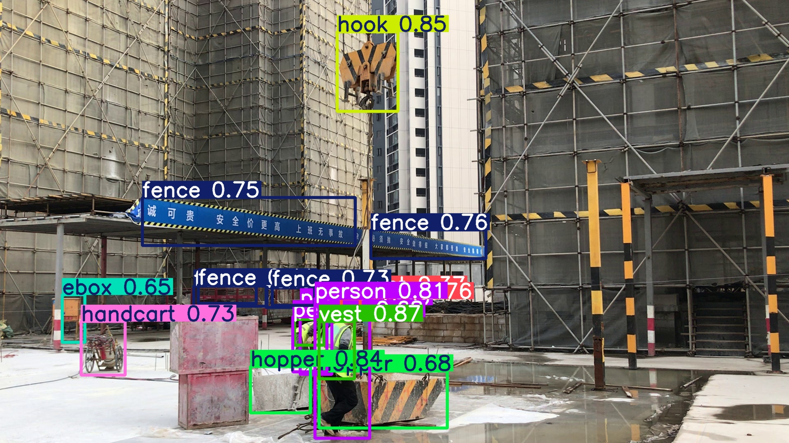

# 🏗️ AutoDraftAI

**AutoDraftAI** is an AI-powered construction site image processing pipeline that:
- Detects objects like people, helmets, and scaffolds
- Generates bounding-box annotations
- Outputs both annotated images and CAD-compatible DXF files

It uses a fine-tuned [YOLOv8](https://github.com/ultralytics/ultralytics) model trained on the SODA Construction dataset and is served via a FastAPI backend.

---

## 📸 Comparison: Default YOLOv8 vs Fine-Tuned SODA Model

| Default YOLOv8 (`yolov8n.pt`) | Fine-Tuned on SODA |
|------------------------------|--------------------|
|  |  |

---

## 🔧 Tech Stack

- **YOLOv8** (Ultralytics)
- **FastAPI** for API backend
- **ezdxf** for CAD generation
- **OpenCV**, **Pillow**
- **Trained on**: [SODA Construction Dataset](https://universe.roboflow.com/sungkyunkwan-university-9qezx/sodaconstruction-awtup)

---

## 🧪 Model Training

```bash
# Run this after dataset is downloaded and soda.yaml is ready
yolo detect train model=yolov8n.pt data=soda.yaml epochs=50 imgsz=640 batch=16 name=yolov8_soda device=0
```

## 💻 File Structure
```
AutoDraftAI/
├── app/
│   ├── main.py
│   ├── routes/
│   │   └── predict.py
│   ├── services/
│   │   ├── inference.py
│   │   └── cad_generator.py
├── models/
│   └── yolov8/
│       └── soda_best.pt
├── data/
│   └── sample_images/
├── dxf_outputs/
├── assets/                # Comparison images for GitHub
├── soda.yaml
├── requirements.txt
├── README.md
```
## 📦 Dataset (SODA Construction)

This project uses the [SODA Construction Dataset](https://universe.roboflow.com/sungkyunkwan-university-9qezx/sodaconstruction-awtup) for training.

### 🔽 Download Instructions

1. Visit the [SODA dataset page on Roboflow](https://universe.roboflow.com/sungkyunkwan-university-9qezx/sodaconstruction-awtup)
2. Sign in (free account required)
3. Click `Download Dataset`
4. Choose **YOLOv5/YOLOv8 format**
5. Extract it to your project directory as:

## ⚙️ Requirements
```bash
pip install -r requirements.txt
```

## 🔧 Setup (Python 3.10 + GPU Recommended)
### 1. Clone the repo
```bash
git clone https://github.com/YOUR_USERNAME/AutoDraftAI.git
cd AutoDraftAI
```
### 2. Create and activate a virtual environment
```bash
python -m venv venv
venv\Scripts\activate        # Windows
# or
source venv/bin/activate     # macOS/Linux
```
### 3. Install GPU-compatible PyTorch manually
```bash
pip install torch torchvision torchaudio --index-url https://download.pytorch.org/whl/cu121
```
### 4. Install remaining dependencies
```bash
pip install -r requirements.txt
```
### 5. Run the FastAPI server
```bash
uvicorn app.main:app --reload
```
# Open in browser:
# http://localhost:8000/docs
